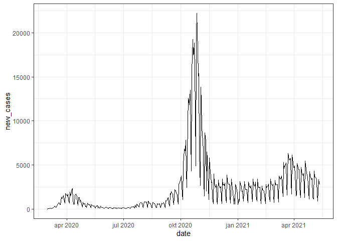
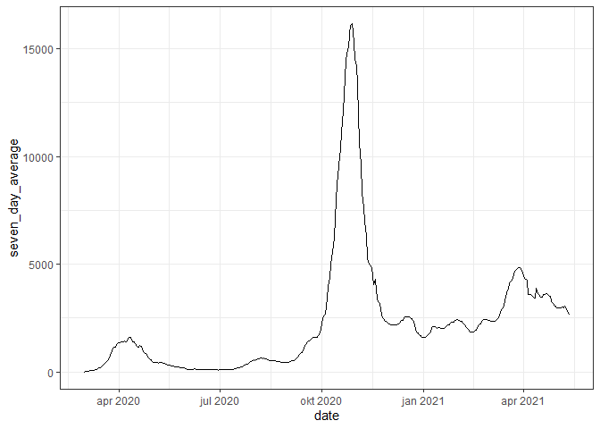
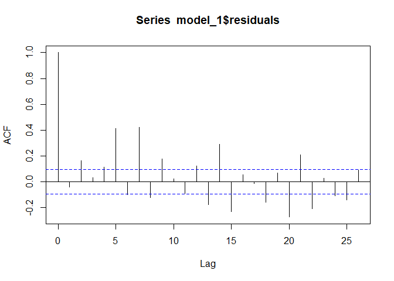
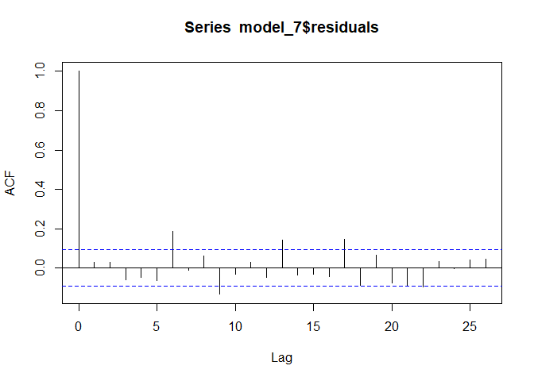
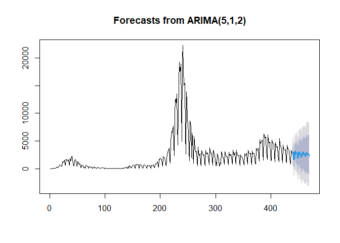
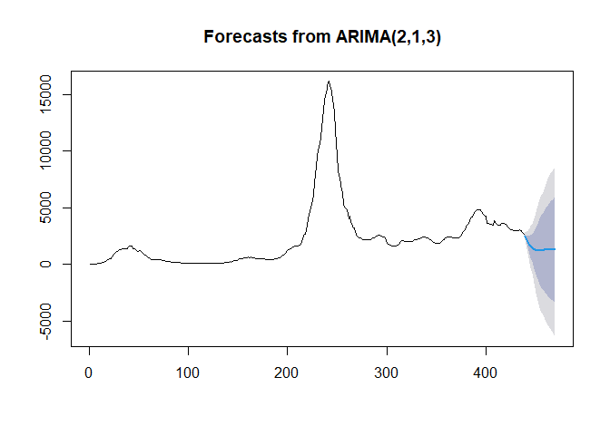
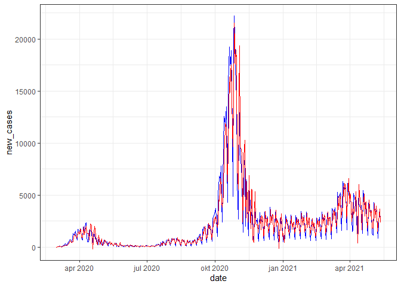
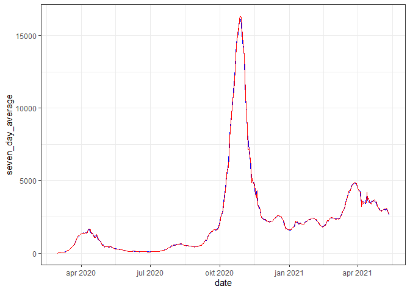

ARIMA Process to Model COVID-19
================
Bruno Deprez
May 17, 2021

# Introduction

In this paper, we consider the ARIMA family of time series processes as
a way to model the evolution of new COVID cases in Belgium. Studying
mathematics on its own is already very interesting and rewarding, but
its true power lies in its ability to be applied to everyday problems.
One of my personal heros, Henri Lebesgue, once said: “Réduites à des
théories générales, les mathématiques seraient une belle forme sans
contenu.”

First, we will look at the data at hand. After that, a short
introduction to ARIMA is given. Finally, we fit an ARIMA process to both
the daily new cases and the seven day average. The performance of the
model is also evaluated.

Note that although the presence of a multitude of formulae in this
document may seem like everything is defined rigorously, the
explanations will mostly be very hand-wavy in order to not make this
document accessible to all but the most hardened mathematicians.
Reader’s discretion is therefore advised when coming across less
well-defined passages in the text.

# The Data

## Setup

Before we can look at the data and begin modelling, we need to load a
couple of libraries in R.

The first one is necessary to easily access the data, see(Guidotti and
Ardia 2020). The `forecast` library will be used to fit our model. The
last two libraries, `ggplot2` and `tidyverse`, make is easier to make
nice plots and work with the dataset. Go to <https://www.tidyverse.org/>
to get more information about the
[tidyverse](https://www.tidyverse.org/).

``` r
library(COVID19)
library(forecast)
library(ggplot2)
library(tidyverse)
```

## The COVID-19 Data

The data can easily be downloaded via the `covid19` function below. In
order to obtain the Belgian data, the country code needs to be set at
56.

Since the data only contains the cumulative numbers, we use the `mutate`
function to add a new column with the new cases. For convenience, we set
the first number equal to 0. It is possible to use another number,
e.g. the number of confirmed cases on this first day, but this will have
negligible impact on the further analysis.

Note that we only take data until 5 days before the day of writing. This
is to prevent to have incomplete data, since the numbers can still be
updated a couple of days later.

``` r
df <- covid19(country = 56, level = 1, start = "2020-03-01", end ="2021-05-12", raw = TRUE, vintage = FALSE, verbose = TRUE, cache =
          TRUE, wb = NULL, gmr = NULL, amr = NULL) %>%
  mutate(new_cases = c(0, diff(confirmed)))
```

The 7 day average is added using the code below. Note that we use a
rolling average, and that we need the `max` function since on the first
six days, we cannot go back long enough to have 7 days in our
observation.

``` r
sda = c()
for(i in 1:length(df$date)){
  sda[i] <- mean(df$new_cases[max(1,i-6):i])
}

df$seven_day_average <- sda
```

In order to get a better grip on the data, we plot both time series.

``` r
ggplot(df, aes(date, new_cases)) +
  geom_line()+
  theme_bw()
```

<!-- -->

``` r
ggplot(df, aes(date, seven_day_average))+
  geom_line()+
  theme_bw()
```

<!-- -->

On the plot with the daily data, one can clearly see what is called *the
weekend effect*, where fewer cases are reported on Saturday and Sunday.

The next section deals with the theory behind ARIMA, used to model these
time series.

# The ARIMA Processes

This section is base on the books (Ruppert and Matteson 2011) and
(McNeil, Frey, and Embrechts 2015).

## Theory

ARIMA is actually a combination of three *sub-processes*, namely the
AutoRegressive, Integrated and Moving Average processes, where each of
them is a special case of the general formula. In order to better
understand the big picture, we are breefly going to zoom in on all
three.

### AR(p)

We begin at the beginning (obviously) with the first-order AR process.
This AR(1) process has the following form, assuming mean 0 (cf. infra):
*X*<sub>*t*</sub> = *ϕ**X*<sub>*t* − 1</sub> + *ε*<sub>*t*</sub>, ∀*t*.
It models the next value at time *t* as a deterministic scaled version
of the previous one, plus some random noise term *ε*<sub>*t*</sub>. It
is intuitive that tomorrow’s number of new COVID cases will depend on
the current level, but that we do not know them exactly. There is,
hence, also some randomness involved.

This autoregressive part captures the long term effects in the time
series, since substituting *X*<sub>*t* − 1</sub> in the above equation
gives
$$
\\begin{aligned}
X\_t & =  \\phi {\\color{blue}{X\_{t-1}}} +\\varepsilon\_t \\\\
X\_t & =  \\phi\\left({\\color{blue}{\\phi X\_{t-2}+\\varepsilon\_{t-1}}}\\right)+\\varepsilon\_t  \\\\
 & \\vdots \\\\
X\_t & = \\phi^{k+1}X\_{t-k-1} + \\sum\_{i=0}^k\\phi^i\\varepsilon\_{t-i}.
\\end{aligned}
$$
When this *ϕ* is close to 1, the influence of previous steps only
diminishes very slowly.

This idea can now be generalised to the AR(p) process of the form
*X*<sub>*t*</sub> − *μ* = *ϕ*<sub>1</sub>(*X*<sub>*t* − 1</sub> − *μ*) + *ϕ*<sub>2</sub>(*X*<sub>*t* − 2</sub> − *μ*) + … + *ϕ*<sub>*p*</sub>(*X*<sub>*t* − *p*</sub> − *μ*) + *ε*<sub>*t*</sub>.
Note that we have introduced a new parameter *μ*. In the first formula,
we have set this equal to 0 for simplicity. When
*ϕ*<sub>1</sub> + … + *ϕ*<sub>*p*</sub> &lt; 1 this equivalent to the
mean of the process *X*<sub>*t*</sub>[1].

### MA(q)

When dealing with the autoregressive process, we only have one
error/noise term in the formula. This is *extended* by the moving
average process, where the MA(q) has the following formula
*X*<sub>*t*</sub> = *μ* + *ε*<sub>*t*</sub> + *θ*<sub>1</sub> ⋅ *ε*<sub>*t* − 1</sub> + … + *θ*<sub>*q*</sub> ⋅ *ε*<sub>*t* − *q*</sub>,
so the random effects from previous times are still present. Since we
assume independence between all *ε*<sub>*i*</sub>, we actually have that
there is no autocorrelation between the different steps
*X*<sub>*t*</sub> in the process. Therefore, the MA(q) process is better
suited to model short term effects, as opposed to the long term effects
that are modeled by the AR(p) process.

### An Integrated Process

Most out-of-the-box data samples cannot be modeled by either an AR(p) or
MA(q) process, or a combination of the two. Think for example of stock
prices or the total number of infected people in Belgium. Especially the
last one goes up, while the AR and MA processes are mean reverting. Much
can be gained when differencing the time series in question. For this,
we need a couple more definitions.

We begin by introducing the backwards operator, *B*, which is just a
fancy way of saying that we move one step back in time:
*B**X*<sub>*t*</sub> = *X*<sub>*t* − 1</sub>,
which is generalised to
*B*<sup>*h*</sup>*X*<sub>*t*</sub> = *X*<sub>*t* − *h*</sub>.

So, the differencing operator, *Δ* = 1 − *B*, takes the difference
between two consequitive steps in the time series:
*Δ**X*<sub>*t*</sub> = (1 − *B*)*X*<sub>*t*</sub> = *X*<sub>*t*</sub> − *X*<sub>*t* − 1</sub>.
For this, one can think of changes in stock prices as the differencing
of the value of the stock, and the newly reported COVID cases as the
differencing of the total confirmed cases. Most of the time,
differencing once will do the trick.

Going back from *Δ**X*<sub>*t*</sub> to *X*<sub>*t*</sub> is called
integrating, hence the name *integrated* process.

### Putting it all together

When we say that something is an ARIMA(p,1,q) process, we actually mean
that *Δ**X*<sub>*t*</sub> can be modelled as an ARMA(p,q) process, where
we introduce both the long term $\\color{purple}{\\text{AR(p)}}$ and
short term $\\color{blue}{\\text{MA(q)}}$ effects into
$$ \\Delta X\_t = \\color{purple}{\\mu+\\phi\_1(\\Delta X\_{t-1}-\\mu) + \\ldots + \\phi\_p(\\Delta X\_{t-p}-\\mu)} \\color{black}{
+ \\varepsilon\_t +}{\\color{blue}{\\theta\_1\\cdot\\varepsilon\_{t-1} + \\ldots + \\theta\_q\\cdot\\varepsilon\_{t-q}}}. $$

Note that AR(1)=ARIMA(1,0,0) and MA(1)=ARIMA(0,0,1).

This is then the final model we are going to use to model the COVID-19
numbers.

## Practice

### Fitting

The above model can easily be fitted to data using the `auto.arima`
function from the `forecast` library. We get the following results.

For the daily numbers, we get a ARIMA(5,1,2) process, which is actually
already a quite complicated model. Note that the process was fitted on
the newly reported cases, so it says that the changes in newly confirmed
cases (change in the change of the total number) is an ARMA(5,2)
process[2].

``` r
model_1 <- auto.arima(df$new_cases); model_1
```

    ## Series: df$new_cases 
    ## ARIMA(5,1,2) 
    ## 
    ## Coefficients:
    ##          ar1      ar2      ar3      ar4      ar5      ma1     ma2
    ##       0.0182  -0.8441  -0.2800  -0.3815  -0.5951  -0.3937  0.6964
    ## s.e.  0.0460   0.0367   0.0534   0.0358   0.0410   0.0488  0.0358
    ## 
    ## sigma^2 estimated as 1133419:  log likelihood=-3665.15
    ## AIC=7346.29   AICc=7346.63   BIC=7378.93

An important statistic we use to judge the fit of the process, is the
auto-correlation, which we already briefly touched upon. This is defined
as follows. We begin with the auto-covariance function *γ*:
*γ*(*h*) = Cov(*Y*<sub>*t*</sub>, *Y*<sub>*t* + *h*</sub>).

The auto-correlation function is then
$$ \\rho(h) = \\frac{\\gamma(h)}{\\gamma(0)}. $$
This expresses the correlation we see between the value at different
time steps. A high *ρ*(*h*) means that large values of
*X*<sub>*t* − *h*</sub> correspond to high values at *X*<sub>*t*</sub>,
and the same for low values. In a perfect ARIMA world, we would have no
auto-correlation between the residuals *ε*<sub>*t*</sub>.

When looking at our first model, we see that this is not the case. Most
of them are significantly different from 0 (they lie autoside the band
defined by the dotted blue lines).

``` r
acf(model_1$residuals)
```

<!-- -->

One solution proposed by the author, is to move away from daily numbers
and model the seven-day average. This smooths away the *seasonal*
effects observed throughout the week, where lower values occur during
the weekends.

``` r
model_7 <- auto.arima(df$seven_day_average); model_7
```

    ## Series: df$seven_day_average 
    ## ARIMA(2,1,3) 
    ## 
    ## Coefficients:
    ##          ar1      ar2      ma1     ma2     ma3
    ##       1.6634  -0.7189  -1.1332  0.1185  0.3580
    ## s.e.  0.0600   0.0566   0.0596  0.0702  0.0477
    ## 
    ## sigma^2 estimated as 14904:  log likelihood=-2718.31
    ## AIC=5448.61   AICc=5448.81   BIC=5473.09

``` r
acf(model_7$residuals)
```

<!-- -->

Observe that the obtained ARIMA(2,1,3) is already a lot simpler, and the
auto-correlations have improved slightly.

### Forecasting

Choosing a model and the theory behind it may be interesting, but if it
has no predictive powers, it is pretty useless[3]. Luckily for us, the
`forecast` library has a built-in function that not only plots the
average forecast, but also the 80% and 95% confidence level.

We predict new case 31 days into the future:

``` r
plot(forecast(model_1, 31, bootstrap = T))
```

<!-- -->

``` r
plot(forecast(model_7, 31, bootstrap = T))
```

<!-- -->

We see that the forecast of the daily cases also captures the
fluctuation present throughout the week. Although the confidence
intervals keep widening, the average prediction is actually converging
quite quickly.

Even though the model for the seven-day average is simpler, its
confidence intervals widen much more quickly, which may reduce the
quality of the predictions in the (near) future. The average prediction
seems to go down quickly.

### Backtesting

In this final section, we apply a rudimentary backtesting procedure but
looking at how well today’s numbers are modeled using the previous
steps. For this, we can use another built-in function, `fitted`:

``` r
df <- df %>%
  mutate(seven_day_fit = fitted(model_7),
         new_cases_fit = fitted(model_1))

ggplot(df, aes(date, new_cases))+
  geom_line(color = "blue") +
  geom_line(aes(date,new_cases_fit), color = "red")+
  theme_bw()
```

<!-- -->

``` r
ggplot(df, aes(date, seven_day_average))+
  geom_line(color = "blue") +
  geom_line(aes(date,seven_day_fit), color = "red")+
  theme_bw()
```

<!-- -->

Especially for the seven-day average, the two curves seem nearly
indistinguishable. The daily model has some problem capturing the peaks
and throughs throughout the weekly cycles. All-in-all, these two models
perform quite well when one want to predict COVID-19 cases in the (very)
near future.

# Conclusion

We have looked at one specific way of modelling time series, namely the
ARIMA(p,1,q) process. In this paper, we went over some of the theory
behind the process. In addition, we applied our newly gained knowledge
on a real-world data set, that of the number of COVID-19 cases in
Belgium.

Although these models seem inadequate from a purely theoretical
standpoint using the auto-correlation of the residuals, we nonetheless
saw that they fit the data quite well on a smaller time horizon.

# References

<div id="refs" class="references csl-bib-body hanging-indent">

<div id="ref-covid" class="csl-entry">

Guidotti, Emanuele, and David Ardia. 2020. “COVID-19 Data Hub.” *Journal
of Open Source Software* 5 (51): 2376.
<https://doi.org/10.21105/joss.02376>.

</div>

<div id="ref-mcneil2015quantitative" class="csl-entry">

McNeil, Alexander J, Rüdiger Frey, and Paul Embrechts. 2015.
*Quantitative Risk Management: Concepts, Techniques and Tools-Revised
Edition*. Princeton university press.

</div>

<div id="ref-ruppert2011statistics" class="csl-entry">

Ruppert, David, and David S Matteson. 2011. *Statistics and Data
Analysis for Financial Engineering*. Vol. 13. Springer.

</div>

</div>

[1] To honour my mathematics professors, we classify this fact as an
U.O.V.T. *uitstekende oefening voor thuis*, which means that we leave
this as an exercise to the reader.

[2] An other U.O.V.T. is verifying that starting from the total number
of cases results in an ARIMA(5,2,2) process.

[3] Unless you make a model to understand the underlying drivers of your
observations, but here this is not the case.
